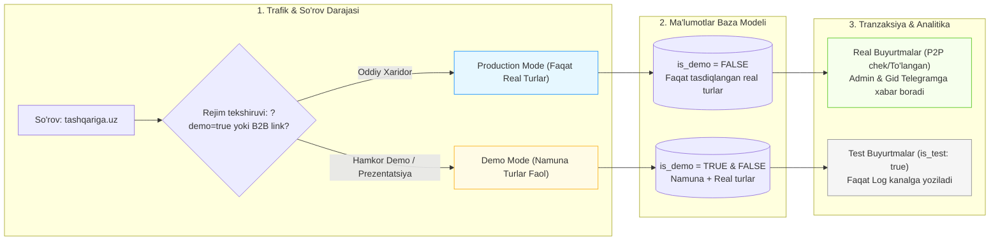
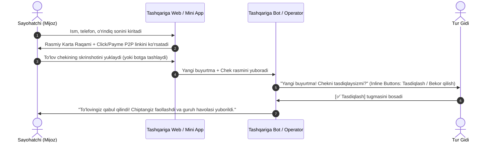

# 🏔️ TASHQARIGA.UZ — MVP PRUNING & PRODUCTION ARCHITECTURE
**Hujjat turi:** Mahsulot Tahlili, UX Tanqidi va Arxitektura Rejasi  
**Muallif:** Senior Product Manager & Ruthless UX Critic  
**Sana:** 2026-yil 20-sentyabr  
**Fayl manzili:** `d:/antigravity/Tashqariga/MVP_PRUNING_AND_ARCHITECTURE.md`

---

## 🎯 Boshqaruv Xulosasi: Mahsulot Holatining Qat'iy Tashxisi

Hozirgi `Tashqariga.uz` holati — **klassik "Pre-revenue Over-engineering" (daromaddan oldingi ortiqcha murakkablashtirish)** holatida. 

Platforma vizual jihatdan zamonaviy va ta'sirli ko'rinsa-da, unda bitta ham real tranzaksiya o'tmagan bo'lishiga qaramay, 4 qavatli filtratsiya, keshbek-loyallik tizimi ("MountainCoins"), soxta to'lov shlyuzlari va B2C sahifasida ochiq yotgan B2B boshqaruv paneli kabi **chalg'ituvchi dekoratsiyalar** mavjud. 

Ayni paytda eng katta xavf — **birinchi real hamkor (tur-operator/gid) platformaga kelganida, tizim xom prototip ekanligini sezib qolishi** yoki test buyurtmalari bilan uning real o'rindiqlari va statistikasi aralashib ketishidir.

Ushbu hujjat 3 ta strategik masalaga qat'iy yechim beradi:
1. **MVP Pruning:** Nimani zudlik bilan olib tashlash yoki soddalashtirish kerak?
2. **Demo vs Production Isolation:** Hamkorlarga namuna ko'rsatish va real turlarni bir-biridan xavfsiz ajratish arxitekturasi.
3. **First 10 Sales:** Birinchi 10 ta real chiptani sotish uchun ayni paytda yetishmayotgan 3 ta eng kritik funksiya.

---

## ✂️ 1-QISM: MVP ni Shafqatsiz Kesish (Pruning & Trimming)

> [!CAUTION]
> **Mahsulot qoidasi:** Hali 10 ta xaridori bo'lmagan startapda har bir ortiqcha tugma, har bir keraksiz tushuntirish va har bir soxta ssenariy konversiyani 20-40% ga tushiradi. Foydalanuvchi "bu haqiqiy servismi yoki sinov saytimi?" deb ikkilanishi bilanoq sahifani yopadi.

### 1.1. Zudlik bilan olib tashlash yoki yashirish kerak bo'lgan 5 ta ortiqcha element

| # | Element / Funksiya | Nima uchun hozir xato va zararli? | Qilinadigan harakat (Verdict) |
|---|---|---|---|
| **1** | **MountainCoins / Tog' Tangasi (Keshbek & Referral balansi)** | 0 ta tranzaksiya bor joyda 30,000 so'mlik virtual valyuta tarqatish unit-iqtisodiyotni xiralashtiradi. Real gid "Mening turimga 30 ming so'm chegirma qilib beradigan bu pulni kim to'laydi?" deb e'tiroz bildiradi. | **Butunlay muzlatish / UI'dan olib tashlash.** Buni faqat 100+ chipta sotilgach, takroriy xaridlarni rag'batlantirish uchun qaytarish kerak. |
| **2** | **Soxta To'lov Shlyuzlari (Click, Payme, Uzum, "0 so'm Tezkor Sinov")** | Foydalanuvchi Click/Payme ni tanlab tugmani bossa, haqiqiy to'lov ilovasi ochilmaydi — shunchaki 1 soniyadan keyin "Chiptangiz tayyor!" deb chiqadi. Bu real xaridor ko'zida **aldov (fake)** tuyg'usini uyg'otadi. U "Bu joyim rostdan band bo'ldimi yo o'yinmi?" deb ishonmay qoladi. | **Soxta variantlarni yo'qotish.** O'rniga bitta shaffof va real ishlaydigan kanal qo'yish: **Karta raqami + Chek yuborish** yoki to'g'ridan-to'g'ri **Operator orqali rasmiylashtirish**. |
| **3** | **Bosh sahifadagi ochiq "B2B Hamkorlar Portali" modal oynasi** | Oddiy sayohatchi saytga kirib, bemalol "Turlar nazorati"ni ochishi, boshqa birovning turini "Joylar to'ldi" holatiga o'tkazishi yoki yangi tur kiritishi mumkin (hatto bu faqat localStorage bo'lsa ham). Bu platformaning jiddiyligiga zarba beradi. | **Bosh sahifa va navbar'dan B2B portalni darhol olib tashlash.** Hamkorlar kabineti alohida maxfiy havola (`/admin` yoki `/partner?auth=...`) yoki Telegram botdagi `/admin` orqali bo'lishi shart. |
| **4** | **Haddan tashqari ko'p filtrlar (Over-filtering)** | Hozir bazada 4-5 ta namuna tur bor. Lekin filtrda: 4 ta Kategoriya, 3 ta Segment (Standard, Gold, VIP), 3 ta Qiyinlik darajasi, Qidiruv paneli bor. Foydalanuvchi bitta filtrni bossa — darhol *"Ushbu filtrlar bo‘yicha safarlar topilmadi"* xatosi chiqadi. Bo'sh sahifa — konversiya qotili. | **Filtrlarni 1 qatorga tushirish:** Faqat 2 ta oddiy yorliq qoldirish: **"Barcha safarlar"** va **"Eng yaqin dam olish kunlari"**. Qolgan hamma segment/kategoriya filtrlarini yashirish. |
| **5** | **QR-kodli Chiptani Skanerlash Xomxayoli (Unusable QR Code)** | Chiptada chiroyli dinamik QR kod generatsiya bo'ladi. Lekin gidning qo'lida bu QR kodni o'qiydigan validator ilova yoki bazaga ulangan skaner yo'q! Gid tog' avtobusiga odam chiqarayotganda QR skaner qilmaydi — unga faqat **Ism, telefon raqam va chek tasdig'i** kerak. | **QR kodni asosiy e'tibordan olib tashlash.** Chiptada eng ko'zga ko'ringan narsa: **Chipta raqami, Gidning telefon raqami va Guruh havolasi** bo'lishi kerak. |

---

### 1.2. Soddalashtirilgan MVP Foydalanuvchi Yo'li (Lean User Flow)

Oldingi va taklif etilayotgan soddalashtirilgan oqim solishtirmasi:

```mermaid
graph TD
    subgraph OLD_COMPLEX_FLOW["Eski Murakkab Oqim (Ko'p xatoliklar)"]
        A1[Saytga kirish] --> B1[4 xil filtrni bosish va bo'sh natija olish]
        B1 --> C1[Tur tafsilotini ochish]
        C1 --> D1[Bron qilish: Keshbek tangasini qo'llash]
        D1 --> E1[Soxta Click/Payme tanlash]
        E1 --> F1[0 so'mga QR chipta olish - Gid bexabar]
    end

    subgraph NEW_LEAN_FLOW["Yangi Sodda va Ishonchli Oqim (10 ta sotuv uchun)"]
        A2[Saytga yoki Botga kirish] --> B2[Eng yaqin dam olish kunidagi 1-2 ta Real Turni ko'rish]
        B2 --> C2[Tur tafsiloti: Real fotosuratlar, qat'iy dastur va qolgan joylar soni]
        C2 --> D2[Bron qilish: Ism + Telefon + Joy soni]
        D2 --> E2[To'lov: Real karta raqami yoki Payme/Click havola]
        E2 --> F2[Avtomatik Telegram guruhga qo'shilish + Gidga real-vaqtda SMS/Telegram bildirishnoma]
    end

    style OLD_COMPLEX_FLOW fill:#fff1f0,stroke:#ff4d4f,stroke-width:1px
    style NEW_LEAN_FLOW fill:#f6ffed,stroke:#52c41a,stroke-width:2px
```



---

## 🏛️ 2-QISM: Prototip va Haqiqiy Serverni Ajratish Arxitekturasi (Demo vs Production)

### 2.1. Muammo va Xavf
Biz birinchi real hamkor bilan gaplashayotganda 2 ta zid vaziyat yuzaga keladi:
1. **Hamkorga ko'rsatish uchun:** Sayt to'la, gavjum va jozibador ko'rinishi kerak (buning uchun So'qoq, Urungach, Chimyon kabi namuna turlar kerak).
2. **Haqiqiy xaridor uchun:** Agar xaridor soxta namuna turga pul to'lab qo'ysa yoki real hamkor o'zining turlari orasida begona "namuna" turlarni ko'rsa — platformaning reputatsiyasi yo'qoladi.
3. **Statistika ifloslanishi:** Sinov buyurtmalari (test bookings) real savdo ko'rsatkichlari (GMV, o'rtacha chek, gidga to'lanadigan to'lovlar)ni butunlay chalkashtirib yuboradi.

---

### 2.2. Tavsiya etiladigan 3 Pog'onali Izolyatsiya Arxitekturasi



#### A. Ma'lumotlar Modeli Darajasida Ajratish (Data Schema)

`src/types/index.ts` fayliga quyidagi qat'iy maydonlar kiritiladi:

```typescript
export type TourEnvironment = 'production' | 'demo';
export type TourStatus = 'active' | 'draft' | 'archived';

export interface Tour {
  id: string;
  // ... mavjud maydonlar
  isDemo: boolean;          // true = faqat taqdimot uchun namuna, false = real sotuvdagi tur
  status: TourStatus;       // 'active' bo'lsa xaridorga ko'rinadi
  partnerId: string;        // Real hamkor ID'si (masalan, 'partner-sharq-trek') yoki 'system-demo'
  publishedAt?: string;
}

export interface Booking {
  id: string;
  // ... mavjud maydonlar
  isTestBooking: boolean;   // true = test sinovi, false = real to'lov qilingan buyurtma
  environment: 'production' | 'demo';
  paymentStatus: 'pending_verification' | 'paid' | 'cancelled';
  proofReceiptUrl?: string; // Yuklangan to'lov cheki skrinshoti
}
```

#### B. UI va Ko'rinish Darajasida Ajratish (Frontend Isolation)

1. **Production rejimida (Standart tashqariga.uz):**
   - So'rov default holda faqat `tours.filter(t => !t.isDemo && t.status === 'active')` ni qaytaradi.
   - Agar real hamkor hozircha faqat 1 ta bo'lsa va uning 2 ta turi bo'lsa, saytda faqat o'sha 2 ta real tur ko'rinadi! Qolgan joyda esa: *"Keyingi haftadagi yangi marshrutlar e'lon qilinmoqda — xabardor bo'lish uchun Telegram kanalimizga qo'shiling"* degan ishonchli CTA blok qo'yiladi. Bu 5 ta soxta turdan 100 baravar ishonchliroqdir.

2. **Demo / Taqdimot rejimida (Hamkorlar uchun maxsus havola):**
   - Agar URL'da maxsus parametr bo'lsa (masalan, `tashqariga.uz/?demo=true` yoki `partner.tashqariga.uz`):
     - Demo turlar ko'rinadi, lekin har bir demo tur kartasida aniq va chiroyli belgi bo'ladi:  
       `🟡 NAMUNA TUR (Taqdimot uchun)`.
     - Hamkor ushbu tur orqali tizim qanday ishlashini ko'radi, lekin xaridor adashib buni real deb o'ylamaydi.

#### C. Hamkor Kabinetidagi "Sandbox (Sinov)" Rejimi

Hamkorlar uchun B2B portal ochilganda (masalan, `/partner` sahifasida):
- Hamkor o'zining shaxsiy `partnerId` si bo'yicha tizimga kiradi.
- U boshqa hamkorlarning turlarini ko'rmaydi va o'zgartira olmaydi.
- Unga ikkita rejim tugmasi beriladi:
  - **"Sinov Rejimi (Sandbox)"** — o'zi yaratgan turni sinovdan o'tkazishi, test buyurtma yuborib ko'rishi mumkin.
  - **"Jonli Sotuv (Live)"** — tur moderator tomonidan tasdiqlangach, real mijozlarga sotuvga chiqadi.

---

### 2.3. Test Ma'lumotlari Statistikani Buzmasligining Texnik Kafolati

Test buyurtmalar real moliyaviy hisobotlarni ifloslantirmasligi uchun quyidagi 3 qoida joriy qilinadi:

1. **Statistika So'rovlarida Qat'iy Shart (Strict Query Filter):**
   ```javascript
   // Baza darajasidagi analitika hisob-kitobi
   function calculateFinancialMetrics(bookings) {
     const realBookings = bookings.filter(b => 
       b.isTestBooking === false && 
       b.paymentStatus === 'paid' && 
       b.environment === 'production'
     );

     return {
       totalGMV: realBookings.reduce((sum, b) => sum + b.totalPrice, 0),
       totalTicketsSold: realBookings.reduce((sum, b) => sum + b.seatsCount, 0),
       uniqueCustomersCount: new Set(realBookings.map(b => b.customerPhone)).size,
       partnerPayouts: calculatePartnerCommissions(realBookings)
     };
   }
   ```

2. **Telegram Bildirishnomalarini Ajratish (Routing by Channel):**
   - **Real Xarid:** Bildirishnoma asosiy **`#ADMIN_SALES`** Telegram guruhiga va to'g'ridan-to'g'ri mas'ul Gidning shaxsiy Telegramiga yuboriladi:
     > 🟢 **REAL XARID! Chipta Sotildi!**  
     > **Mijoz:** Sardor Aliyev (+998 90 123 45 67)  
     > **Marshrut:** So'qoq Sharsharasi (2 o'rin)  
     > **Jami summa:** 380,000 so'm (To'lov cheki ilova qilindi)
   - **Test / Demo Xarid:** Asosiy kanalga kirmaydi. Faqat ishlab chiquvchilarning **`#DEV_LOGS`** guruhiga yuboriladi:
     > 🟡 **[TEST / DEMO ORDER]**  
     > Ushbu buyurtma sinov rejimidan tushdi. Asosiy statistikaga qo'shilmadi.

3. **Baza Darajasida `is_test` Flagini O'chirib Bo'lmasligi:**
   - Agar buyurtma to'lov usuli "Sinov" bo'lsa yoki demo havoladan berilgan bo'lsa, tizim uni avtomatik ravishda `isTestBooking: true` deb tamg'alaydi. Uni hatto admin ham qo'lda real buyurtmaga aylantira olmaydi.

---

## 🚀 3-QISM: Birinchi 10 Ta Chiptani Sotish Uchun Yetishmayotgan 3 Ta Kritik Funksiya

Hozir saytda chiroyli qobiq bor, lekin nega undan bugunoq 10 ta chipta sotib olinmaydi? Sababi — tog' turizmida xarid qarori qanday qabul qilinishidagi **psixologik to'siqlar yechilmagan**. 

Quyidagi 3 ta funksiya bo'lmasa, hatto 10,000 kishi saytga kirsa ham xarid qilmaydi:

---

### 🔥 1-KRITIK FUNKSIYA: "Trust Bridge" — Gid bilan 1-Bosishda Jonli Bog'lanish va Telegram Guruhga Integratsiya

#### Muammo:
O'zbekistonda tog' sayohatiga chiqadigan odam begona saytga 200-300 ming so'm pulini shunchaki tashlab yubormaydi. U doimo quyidagilarni bilishni istaydi:
- *"Avtobus qaysi markada? Konditsioneri bormi?"*
- *"Ob-havo yomon bo'lsa nima bo'ladi?"*
- *"Bolalar yoki ota-onam bilan borsam qiynalmaydimi?"*
- *"Tushlikda nima yeymiz?"*

Hozirgi saytda savol berish uchun qulay, jonli va ishonchli ko'prik yo'q.

#### Kerakli Yechim:
1. **Har bir tur kartasi va modalida "Gidga savol berish" tugmasi:**
   - Tugma to'g'ridan-to'g'ri gidning Telegram profili yoki maxsus operator botiga o'tishi kerak:  
     `https://t.me/tashqariga_support?start=tur_soqoq_savol`
2. **Chipta olingach darhol Telegram Guruhga Qo'shilish (Trip Telegram Group):**
   - Chipta tasdiqlangan zahoti foydalanuvchi ekranida va SMS/Telegram xabarida bitta katta yashil tugma chiqadi:  
     **"🎒 Safar Ishtirokchilari Guruhiga Qo'shilish (Telegram)"**.
   - Odam boshqa qatnashchilarni va gidni guruhda ko'rgandagina xavotiri yo'qoladi va puliga achinmaydi.

---

### 💳 2-KRITIK FUNKSIYA: Zero-Friction Real To'lov va Chek Tasdig'i (Day-1 Payment Flow)

#### Muammo:
Hozirgi soxta Click/Payme tugmalari pul qabul qilmaydi. Real ekvayring shartnomasi tuzish (Click/Payme Merchant API) esa yuridik hisob raqam, to'lov xizmatlari litsenziyasi va integratsiya uchun 1-2 hafta vaqt oladi. Birinchi 10 ta chiptani sotish uchun bu juda kech.

#### Kerakli Yechim (Day-1 Real Payment Flow):
O'zbekistondagi eng tez va 100% ishlaydigan MVP to'lov mexanizmi:



- **Mijoz uchun qulaylik:** U o'zining Click yoki Payme ilovasidan tanish karta raqamiga pul o'tkazadi va chekni ilova qiladi.
- **Platforma uchun qulaylik:** Murakkab billing shlyuzlarisiz bugunoq haqiqiy pul tushishni boshlaydi.

---

### 📸 3-KRITIK FUNKSIYA: Mahalliy Ijtimoiy Isbot (Local Social Proof) va Real Jonli O'rindiqlar

#### Muammo:
Hozirgi rasm va ma'lumotlar Unsplash fondidan olingan bo'lib, O'zbekiston tog'larining haqiqiy muhitini aks ettirmaydi. Sayohatchilar chet el tog'lari rasmini ko'rganda "Bu real sayohat emas, shablon sayt" deb gumon qiladi.

#### Kerakli Yechim:
1. **Real Fotosuratlar va Video-Snipetlar:**
   - Har bir turga Toshkent viloyati, Bo'stonliq yoki Parkentdagi haqiqiy gid va jamoaning oxirgi safaridan 3-4 ta real surati (avtobus, qozon kabob, archazorlar, jamoaviy selfi).
2. **Gidning Haqiqiy Profili va Kafolati:**
   - Shunchaki "Sharq Trek" emas, balki: *"Gid: Dilshod Rustamov — 7 yillik tajriba, tog' qutqaruvchisi sertifikati, 120 dan ortiq muvaffaqiyatli yurishlar"*.
3. **Haqiqiy "Jonli O'rindiqlar" Sayg'ochi (Urgency & Scarcity):**
   - 18 ta joydan nechtasi real qolganini ko'rsatish:  
     `🔥 Faqat 4 ta joy qoldi (14 kishi allaqachon ro'yxatdan o'tdi)`.
   - Joylar soni bot orqali har safar chipta sotilganda avtomatik kamayadi. Bu xaridorni tezroq qaror qabul qilishga undaydi (FOMO effekti).

---

## 🛠️ 4-QISM: Zudlik Bilan Amalga Oshiriladigan Ishlar Rejasi (Action Plan)

### 4.1. Bugun Kodda Qilinadigan O'zgarishlar (Immediate Pruning Checklist)

- [ ] **`src/types/index.ts`:**
  - `Tour` modeliga `isDemo: boolean` va `status: 'active' | 'draft'` maydonlarini qo'shish.
  - `Booking` modeliga `isTestBooking: boolean` va `paymentStatus` maydonlarini qo'shish.
  - `UserProfile` dagi `mountainCoins` ni UI'dan yashirish.
- [ ] **`src/components/Navbar.tsx` & `src/components/MobileBottomNav.tsx`:**
  - Ochiq "B2B Portal / Gidlar Kabineti" tugmasini oddiy menyudan olib tashlash. (Faqat `/partner` maxsus sahifasi orqali kiriladigan qilish).
- [ ] **`src/components/BookingModal.tsx`:**
  - "Keshbek ballarini ishlatish" blokini butunlay olib tashlash.
  - Soxta 4 ta to'lov tugmasini olib tashlab, o'rniga bitta real to'lov bloki: **"Karta orqali to'lov (Click/Payme) va Chek tasdig'i"** ni o'rnatish.
- [ ] **`src/components/CategoryFilter.tsx`:**
  - Ko'p qavatli Segment va Qiyinlik filtrlarini yashirish. Faqat 1 qatorlik toza ko'rinish qoldirish.
- [ ] **`src/data/tours.ts`:**
  - 5 ta turdan 3 tasiga `isDemo: true` berish.
  - 1-2 ta eng jozibador real turni `isDemo: false` qilib, real sana va real gid raqamlari bilan to'ldirish.

---

### 4.2. Birinchi 10 Ta Chiptani 7 Kunda Sotish Taktikasi (Playbook)

1. **1-Kun: 1 ta Real Hamkor bilan Kelishuv:**
   - Toshkentdagi 1 ta faol hiking klubi (masalan, Shanba yoki Yakshanba kuni So'qoqqa yoki Chimyonga chiqayotgan jamoa) bilan gaplashish.
   - Taklif: *"Biz sizning ushbu haftadagi safaringizga 10 ta joyni bepul sotib beramiz, sizdan faqat sayyohlarga a'lo darajada xizmat ko'rsatish"*.
2. **2-Kun: Landing va Botni O'sha Safarga Moslash:**
   - Bosh sahifada faqat o'sha 1 ta safarni "Haftaning Bosh Voqeasi" sifatida katta qilib joylash.
3. **3-5-Kun: Maqsadli Trafikni Yo'naltirish:**
   - Toshkentdagi faol yoshlar, IT-kompaniyalar xodimlari va tabiat ishqibozlari kanallariga 1 ta safar haqida qisqa, aniq e'lon berish:
     *"Ushbu shanba kuni So'qoq sharsharasiga boramiz. Qulay transport, tog' kabobi va ajoyib jamoa. Faqat 10 ta bo'sh o'rin. Bron qilish: tashqariga.uz"*.
4. **6-Kun: Buyurtmalarni Tasdiqlash va Telegram Guruhni Ochish:**
   - Tushgan 10 ta buyurtma egalarini alohida Telegram guruhga yig'ish, instruktaj berish.
5. **7-Kun: Safarni Amalga Oshirish & Foto/Video Kontent To'plash:**
   - Safarda qatnashchilar bilan jonli video-intervyular olish — bu keyingi 100 ta chipta uchun asosiy isbot bo'ladi.

---

## 🏁 Xulosa

Hozirgi `Tashqariga.uz` kodi chiroyli poydevorga ega, biroq unda **ortiqcha narsalar ko'p, haqiqiy sotuv uchun eng zarur 3 ta narsa esa yo'q**.

Loyihani haqiqiy biznesga aylantirish siri — yangi funksiyalar qo'shishda emas, aksincha: **barcha chalg'ituvchi o'yinchoqlarni kesib tashlab, xaridor va gid o'rtasidagi ishonchli to'lov va muloqot zanjirini mukammal ishlashini ta'minlashda**. 

Ushbu arxitektura bo'yicha Demo va Real rejimlarni ajratsak, birinchi hamkor bilan yuzimiz yorug' bo'ladi va test ma'lumotlari haqiqiy daromad hisobini hech qachon buzmaydi.
